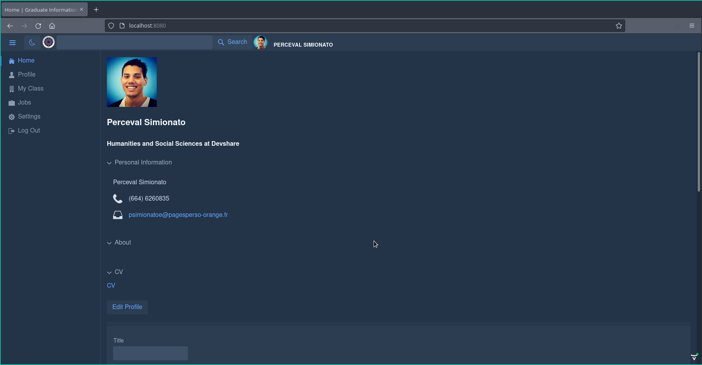

<br />
<p align="center">
  <a href="https://github.com/umutsevdi/graduate-information-system">
    
  </a>

  <h3 align="center">Graduate Information System</h3>

  <p align="center">
    Graduate Information System project for the Database Systems Lecture made with Java, Postgresql and love :)
    <br />
    <a href="#about-the-project"><strong>Explore the docs »</strong></a>
    <br />
    

</p>

<details open="open">
  <summary>Table of Contents</summary>
  <ol>
    <li>
      <a href="#about-the-project">About The Project</a>
      <ul>
        <li><a href="#built-with">Built With</a></li>
      </ul>
    </li>
    <li>
      <a href="#getting-started">Getting Started</a>
      <ul>
        <li><a href="#prerequisites">Prerequisites</a></li>
        <li><a href="#installation">Installation</a></li>
      </ul>
    </li>
    <li><a href="#features">Features</a></li>
    <!-- <li><a href="app/README.md">Documentation</a></li> -->
    <li><a href="app/LICENSE.md">License</a></li>
    <li><a href="#problems">Problems</a></li>
    <li><a href="#contact">Contact</a></li>
  </ol>
</details>


## 1- About The Project

In Database System's Lecture, we learned alot about database systems. And at the end of the semester we were required to build a GUI application that can perform different SQL queries. A classic approach would be using Java Swing Library with JDBC. But I didn't do that. 
I had about a year of experience building projects with Spring Framework. And I know how powerful it is. Altough I have always built the backend of the projects and never really got a chance to try creating UI. 

For this I picked <a href ="https://vaadin.com/"> Vaadin Framework</a>. It is a framework built on top of Spring, to create Progressive Web Applications. 

It took a while to learn all the components but the results were worth it!


### 1.1 - Built With

Here is the list of technologies I've used in the project.
* [Spring Boot](https://spring.io/)
* [Vaadin](https://vaadin.com/)
* [Posrgresql](https://www.postgresql.org/)
* [Docker](https://www.docker.com/)


## 2- Getting Started

To run this project locally, you need following to set up  setting up your project locally.
To get a local copy up and running follow these simple example steps.

### 2.1- Prerequisites

This is an example of how to list things you need to use the software and how to install them.
- Java
- Maven
- Docker
  
You don't need to download Postresql since my Dockerfile automatically configures it for you.

### 2.2- Installation

1. Clone the repo
   ```sh
   git clone https://github.com/umutsevdi/graduate-information-system.git
   ```
2. Run the docker-compose.yaml
   ```sh
    docker-compose up --build
   ```
3. Download required Java libraries
   ```sh
   mvn clean install
   ```

## 3- Features

### 3.1- Login / Register
- User can login or register to our application. When they register their informations are saved into the database. When they login, their session is stored in the memory of the application with a randomized token.
- Users are redirected automatically to login page when their token timeouts or their session is not found.
  


### 3.2- Home
After login users are navigated to the Home Page. Here, they can see the posts of the people from the user's university. 

Users can post announcements and delete their existing ones. Also they can like each others' posts.


### 3.3- Profile
Each user has profile. In profile page you can see basic information about that person and their posts.
You can edit your information by pressing edit profile button.



### 3.4- My Class
Each graduated user can see posts spesific to their faculty. And also users can see people they graduated with. 


### 3.5- Jobs
Users can find jobs that are published by other users. Here you can apply to jobs by using forms. Users who do not work at a company can not create job applications. Users can not sign up for job applications created by themselves.


## 4- Problems

This project is built for Database Systems project and because of the deadline it contains serious bad practices such as:
- It is open to <a href="https://www.w3schools.com/sql/sql_injection.asp">SQL Injection</a>. 
- Passwords are not hashed. 
  
**Please do not use it in anything serious.**


## 5- Contact
Project Link: [umutsevdi/graduate-information-system](https://github.com/umutsevdi/graduate-information-system)
